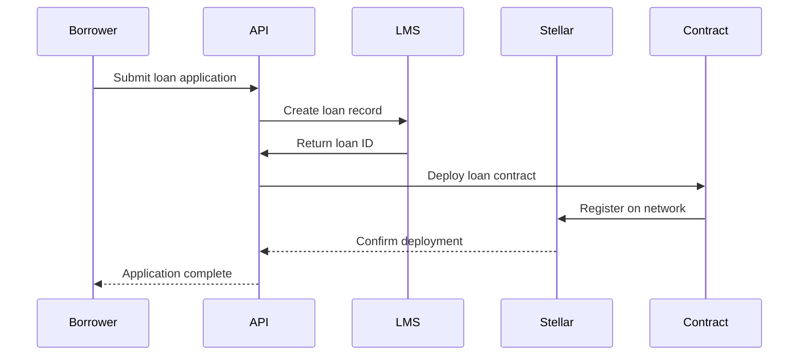
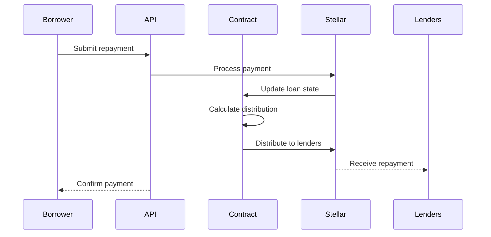

# Loan Management System Integration

## 1. System Architecture

### Data Model
```javascript
// MongoDB Collections

// Loan Schema
{
  _id: ObjectId,
  loan_type: String,       // ['business', 'agriculture', 'infrastructure']
  amount: Number,
  term_months: Number,
  interest_rate: Number,
  status: String,          // ['pending', 'active', 'repaying', 'completed', 'defaulted']
  borrower_id: ObjectId,
  lenders: [{
    user_id: ObjectId,
    amount: Number,
    date: Date
  }],
  repayment_schedule: [{
    due_date: Date,
    amount: Number,
    status: String,       // ['pending', 'paid', 'overdue']
    actual_payment_date: Date
  }],
  collateral: {
    type: String,
    description: String,
    value: Number
  },
  risk_score: Number,
  loan_purpose: String,
  impact_metrics: [{
    metric_name: String,
    target_value: String,
    current_value: String,
    last_updated: Date
  }]
}

// Repayment Schema
{
  _id: ObjectId,
  loan_id: ObjectId,
  amount: Number,
  payment_date: Date,
  payment_type: String,   // ['scheduled', 'early', 'late']
  stellar_tx_id: String,
  status: String         // ['pending', 'completed', 'failed']
}
```

### Smart Contract Integration
```javascript
// Soroban Smart Contract

contract LoanManagement {
    // Contract state
    struct Loan {
        address borrower;
        u128 amount;
        u128 interest_rate;
        u32 term_months;
        vector<Repayment> schedule;
        LoanStatus status;
        vector<Lender> lenders;
    }

    struct Repayment {
        u128 amount;
        u64 due_date;
        bool paid;
        u64 payment_date;
    }

    struct Lender {
        address lender;
        u128 amount;
    }

    enum LoanStatus {
        Pending,
        Active,
        Repaying,
        Completed,
        Defaulted
    }

    // Key functions
    fn initiate_loan(borrower: address, amount: u128, term: u32) -> LoanId;
    fn add_lender(loan_id: LoanId, lender: address, amount: u128);
    fn process_repayment(loan_id: LoanId, amount: u128);
    fn check_loan_status(loan_id: LoanId) -> LoanStatus;
    fn distribute_repayment(loan_id: LoanId);
}
```

## 2. API Endpoints

```javascript
// RESTful API Structure

// Loan Management
POST   /api/loans                    // Create new loan
GET    /api/loans                    // List loans
GET    /api/loans/:id                // Get loan details
PUT    /api/loans/:id                // Update loan
POST   /api/loans/:id/approve        // Approve loan
POST   /api/loans/:id/reject         // Reject loan

// Repayment Management
POST   /api/loans/:id/repayments     // Record repayment
GET    /api/loans/:id/repayments     // Get repayment history
PUT    /api/loans/:id/repayments/:rid // Update repayment

// Lender Management
POST   /api/loans/:id/lenders        // Add lender
GET    /api/loans/:id/lenders        // Get lenders
GET    /api/lenders/:id/portfolio    // Get lender's portfolio

// Risk Assessment
GET    /api/loans/:id/risk           // Get risk assessment
POST   /api/loans/:id/risk           // Update risk score
```

## 3. Integration Workflows

### Loan Origination Flow


### Repayment Processing Flow


## 4. Risk Management Features

### Automatic Alerts
```javascript
// Risk Monitoring System
const riskAlerts = {
  payment_overdue: {
    days: [1, 3, 7, 15, 30],
    actions: ['notify_borrower', 'notify_admin', 'flag_loan']
  },
  risk_score_change: {
    threshold: 20,
    actions: ['update_loan_status', 'notify_lenders']
  },
  collateral_value: {
    threshold: 0.8,
    actions: ['require_additional_collateral', 'notify_admin']
  }
};
```

### Collection Process
```javascript
// Collection Workflow
const collectionSteps = {
  soft_reminder: {
    timing: 'payment_due - 2 days',
    method: ['email', 'sms']
  },
  first_notice: {
    timing: 'payment_due + 1 day',
    method: ['email', 'sms', 'call']
  },
  escalation: {
    timing: 'payment_due + 7 days',
    method: ['formal_notice', 'digital_nomad_visit']
  }
};
```

## 5. Reporting System

### Loan Performance Metrics
```javascript
// Performance Dashboard Metrics
const loanMetrics = {
  portfolio_health: {
    current_loans: Number,
    at_risk_loans: Number,
    default_rate: Number
  },
  repayment_performance: {
    on_time_rate: Number,
    average_days_late: Number,
    collection_rate: Number
  },
  impact_metrics: {
    jobs_created: Number,
    revenue_increase: Number,
    community_benefit: String
  }
};
```

## 6. Implementation Timeline

1. **Week 1-2: Core Integration**
   - Database schema setup
   - Basic API implementation
   - Smart contract deployment

2. **Week 3-4: Workflow Implementation**
   - Loan origination process
   - Repayment handling
   - Basic reporting

3. **Week 5-6: Risk Management**
   - Alert system
   - Collection process
   - Risk scoring

4. **Week 7-8: Testing & Refinement**
   - Integration testing
   - Performance optimization
   - User acceptance testing

